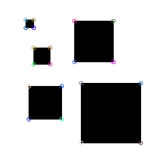
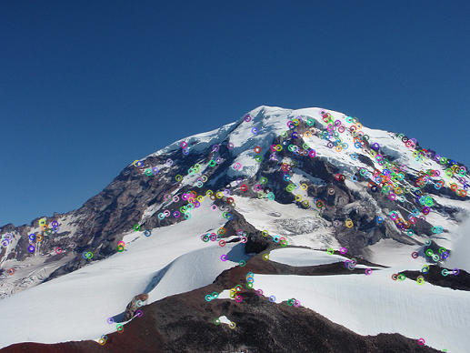
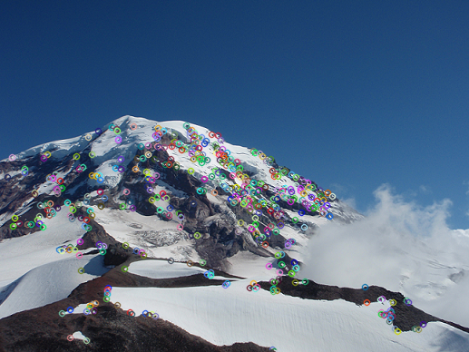
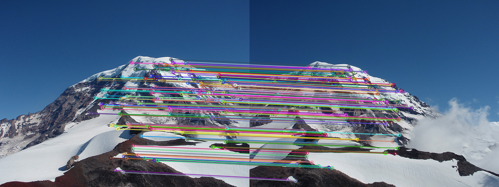
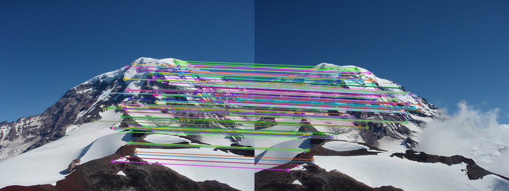
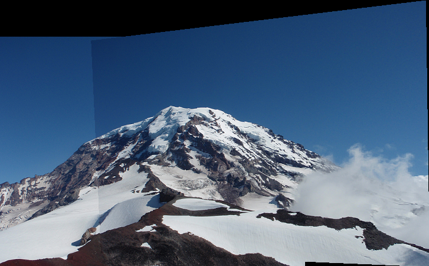
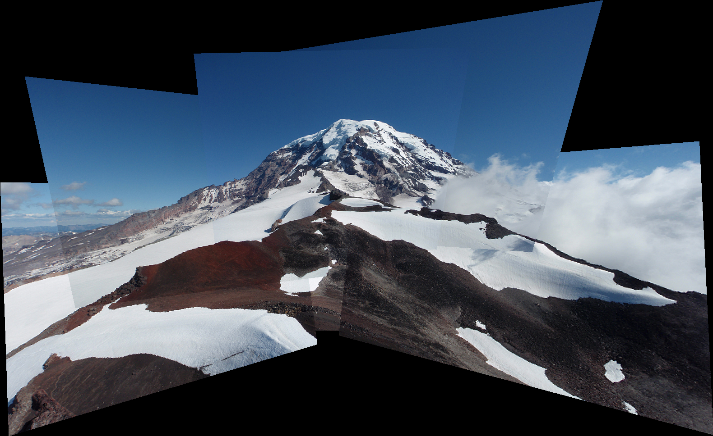
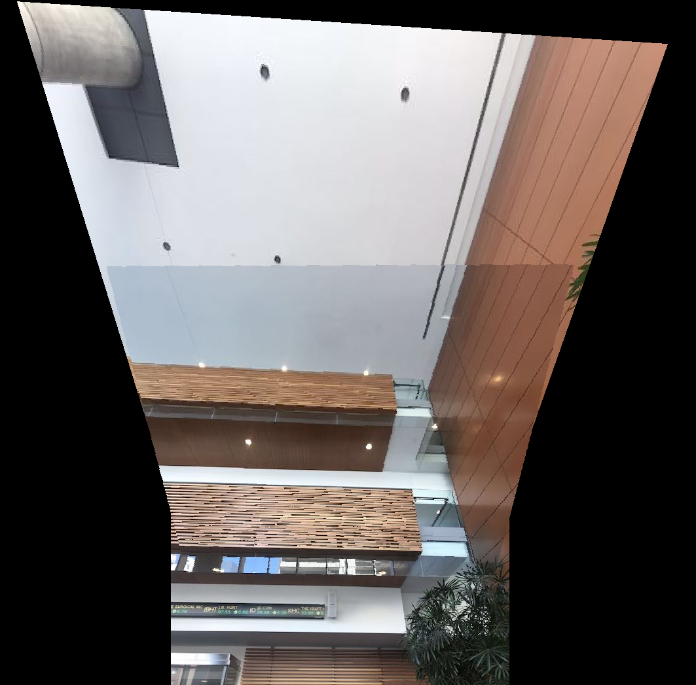

<div align=center>
<p style="font-size:50px"> Concordia University </p>
<p style="font-size:20px; font-style:italic; margin-top: 100px"> Department of software engineer and computer science </p>
</div>

<div align="center" style="margin: 100px">
<p align="center" style="font-size: 15px; font-style: italic; font-weight: lighter; margin: 30px"> COMP 691 – Computer Vision Project Report </p>
<p align="center" style="font-size:15px; font-style: italic; font-weight: lighter;"> Winter 2019 </p>
</div>

<div align=center style="margin: 100px">
<p style="font-size: 20px; margin: 50px; font-weight: bold; line-height: 30px"> Panorama Mosaic Stitching  </p>
</div>

<div align=center style="margin: 100px">
<p style="font-size:15px;"> Lei Xu </p>
</div>

<div align=center style="margin: 100px">
<p style="font-size:15px;"> March 25 2019 </p>
</div>

<div style="page-break-after: always"></div>

<div align=center>
<p style="font-size:15px; margin=20px"> Table of Content </p>
</div>

[toc]

<div style="page-break-after: always"></div>

## Part one  - Feature Detection and Matching

Design the Harris Corner Detection class

### 1.1 For each point in the image, consider a window of pixels around that point

```c++
// Sobel operator sx
float kernel_data0[9]={ -1, 0, 1,
                        -1, 0, 1,
                        -1, 0, 1};
Mat kernel3 = Mat(3, 3, CV_32F, kernel_data0);
filter2D(gray, Dx, gray.depth(), kernel3);
// Sobel operator sy
float kernel_data1[9]={ -1, -1, -1,
                        0,   0,  0,
                        1,   1,  1};
Mat kernel4 = Mat(3, 3, CV_32F, kernel_data1);
filter2D(gray, Dy, gray.depth(), kernel4);
```
### 1.2 Compute the Harris matrix H for that point
	
```c++
DxDy = Dx.mul(Dy);
Dy2 = Dy.mul(Dy);
Dx2 = Dx.mul(Dx);
Mat Kernel(3, 3, CV_64F);
guassian(3, 3, 1 , Kernel);
filter2D(DxDy, DxDy, DxDy.depth(), Kernel);
filter2D(Dx2, Dx2, Dx2.depth(), Kernel);
filter2D(Dy2, Dy2, Dy2.depth(), Kernel);
Mat cornerStrength(gray.size(), gray.type());
for (int i = 0; i < gray.rows; i++)
{
    for (int j = 0; j < gray.cols; j++)
    {
        double det_m = Dx2.at<double>(i,j) * Dy2.at<double>(i,j) - DxDy.at<double>(i,j) * DxDy.at<double>(i,j);
        double trace_m = Dx2.at<double>(i,j) + Dy2.at<double>(i,j);
        cornerStrength.at<double>(i,j) = det_m/trace_m;
    }
}
```

### 1.3 Create 128 dimensions matric 
	
```c++
descriptors = Mat::zeros((int)keypoints.size(), 128, CV_32FC1);//做一个N*128的矩阵存放descriptors
for(int i = 0 ; i < keypoints.size();i++){
    cv::Mat temp = getDescriptor(img, keypoints[i]);//每个key point的descriptor，128个值
    for(int col = 0 ; col < 128; col++){
        descriptors.at<float>(i , col) = temp.at<float>(0, col);//放入矩阵
    }
}
```

### 1.4 Describe an image patch
	
```c++
Mat gray = src;
cvtColor(src, gray, COLOR_BGR2GRAY);
int left = (int)keyPoint.pt.y - 8;
int top = (int)keyPoint.pt.x - 8;
if(top < 0) top += 8;
if(left < 0) left += 8;
if((top + 16) > src.cols) top -= 8;
if((left + 16) > src.rows) left -= 8;
temp = gray(cv::Rect(top,left,16,16));
```
	
### 1.5 Define a theta
	
```c++
 Mat orientation = Mat::zeros(1, 36, CV_32FC1);
int theta;
for(int i = 0; i < patch_dir.rows; i++) {
    for(int j = 0; j < patch_dir.cols; j++) {
        int temp = int(patch_dir.at<float>(i, j) / 10);
        orientation.at<float>(0, temp) += patch_mag.at<float>(i, j);
    }
}
int min = 0;
float temp = -1;
for(int col = 0 ;col < 36;col++) {
    if (temp < orientation.at<float>(0, col)) {
        temp = orientation.at<float>(0, col);
        min = col;
    }
}
theta = 10 * min;
return theta;
```

<div align=center>

<p style="font-size:10px;font-color:#969696">Figure 1.1 Harris Corners for Boxes</p>
</div>

<div align=center>

<p style="font-size:10px;font-color:#969696">Figure 1.2 Harris Corners for Rainier1</p>
</div>

<div align=center>

<p style="font-size:10px;font-color:#969696">Figure 1.3 Harris Corners for Rainier2</p>
</div>

## Part two - Feature Matching

Define a matcher to find the best matching feature in one or more other images

### 2.1 Compute the descriptors for each interest point.

```c++
vector<KeyPoint> keyPoint1;
vector<KeyPoint> keyPoint2;
vector<KeyPoint> keyPoint3;
Mat descriptor_1 = descriptor.descriptor(image_1, keyPoint1);
Mat descriptor_2 = descriptor.descriptor(image_2, keyPoint2);
Mat descriptor_3 = descriptor.descriptor(image_3, keyPoint3);
```

### 2.2 Define a threshold on the match score, called the SSD distance.

```c++
float Matcher::Ssd(int r1, int r2) {
        ssd = 0;
        for(int i = 0; i < getSrc1().cols; i++)
        {
            ssd +=  (getSrc1().at<float>(r1,i) - getSrc2().at<float>(r2,i)) *
                (getSrc1().at<float>(r1,i) - getSrc2().at<float>(r2,i));
        }
        return ssd;
    }
```

### 2.3 Define a ratio text: (score of the best feature match)/(score of the second best feature match)

```c++
void Matcher::ratio(vector<DMatch> &matches) {
    int minkey = 0;
    float threshold = 0.5;
    for(int row1 = 0; row1 < getSrc1().rows;row1++){
        float distsq2= 6;
        float distsq1= 8;
        minkey= 0 ;
        for(int row2 = 0 ;row2 < getSrc2().rows;row2++){
            float SSD = Ssd(row1, row2);
            if(SSD < distsq1){
                distsq2 = distsq1;
                distsq1 = SSD;
                minkey = row2;
            }
        }
        if((distsq1 / distsq2) < threshold){
            DMatch bestPair(row1 , minkey , distsq1);
            matches.push_back(bestPair);
        }
    }
}
```

### 2.4 Add the pair of matching points to the list of matches.

```c++
for( int i = 0; i < good_matches.size(); i++ )
    {
        //-- Get the keypoints from the good matches
        goodPoints.push_back( keypoint1[good_matches[i].queryIdx ].pt );
        matchedPoints.push_back( keypoint2[good_matches[i].trainIdx ].pt );
    }
```

### 2.5 Display the matches using cv::drawMatches(...).

```c++
drawMatches( image1Display, keypoint1, image2Display, keypoint2,
                 good_matches, img_matches, Scalar::all(-1), Scalar::all(-1),
                 vector<char>(), DrawMatchesFlags::NOT_DRAW_SINGLE_POINTS );
```

<div align=center>

<p style="font-size:10px;font-color:#969696">Figure 2.1 Matching Interest Points</p>
</div>

## Part Three - Compute Homography using RANSAC

### 3.1 Implement a function project(x1, y1, H, x2, y2)

This should project point (x1, y1) using the homography “H”. Return the projected point (x2, y2). Hint: See the slides for details on how to project using homogeneous coordinates.

```c++
void Matcher::project(float x1, float y1, Mat &H, float& x2, float& y2) {
    double w = H.at<double>(2, 0) * x1 + H.at<double>(2, 1) * y1 +  H.at<double>(2, 2);
    x2 = float((H.at<double>(0, 0) * x1 + H.at<double>(0, 1) * y1 +  H.at<double>(0, 2)) / w);
    y2 = float((H.at<double>(1, 0) * x1 + H.at<double>(1, 1) * y1 +  H.at<double>(1, 2)) / w);
}
```

### 3.2 Implement the function computeInlierCount

computeInlierCount is a helper function for RANSAC that computes the number of inlying points given a homography "H". That is, project the first point in each match using the function "project". If the projected point is less than the distance "inlierThreshold" from the second point, it is an inlier. Return the total number of inliers.

```c++
void Matcher::computeInlierCount(Mat &H, vector<DMatch> matches, int& numMatches, float inlierThrehold, vector<KeyPoint> keypoint1, vector<KeyPoint> keypoint2) {
    float x, y;
    for(int i = 0; i < matches.size(); i++) {
        if (H.rows == 0 || H.type() == 0) {
            continue;
        }
        project(keypoint1[matches[i].queryIdx].pt.x, keypoint1[matches[i].queryIdx].pt.y, H, x, y);
        float rx = (keypoint2[matches[i].trainIdx].pt.x - x) * (keypoint2[matches[i].trainIdx].pt.x - x);
        float ry = (keypoint2[matches[i].trainIdx].pt.y - y) * (keypoint2[matches[i].trainIdx].pt.y - y);
        float distance = sqrt(rx + ry);
        if(distance < inlierThrehold) {
            numMatches++;
        }
    }
}

```

### 3.3 Match features by RANdom SAmple Consensus (RANAC)

```c++
void Matcher::RANAC(vector<DMatch> matches, int &numMatches, int numIterations, vector<KeyPoint> keypoint1,
                    vector<KeyPoint> keypoint2, Mat &hom, Mat &homlnv, Mat &image1Display,
                    Mat &image2Display) {
                        .......
                    }
```

<div align=center>

<p style="font-size:10px;font-color:#969696">Figure 3.1 After RANSAC Matching for Rainier1 and Rainier2</p>
</div>

## Part four - Stitching

### 4.1 Implement the function stitch

```c++
void Matcher::stitch(Mat &image1, Mat &image2, Mat &hom, Mat &homInv, Mat &stitchedImage, Mat& stitch) {
	...
	//Size
    int stitchRow, stitchCol;
    stitchRow = int(maxY) + int(minY);
    stitchCol = int(maxX) + int(minX);
    stitchedImage = Mat::zeros(stitchRow, stitchCol, image1.type());
    //Put image1 into stitchedImage
    Mat imageROI;
    imageROI = stitchedImage(Rect((int)minX, (int)minY,image1.cols,image1.rows));
    image1.copyTo(imageROI);
    for(int i = 0; i < stitchedImage.rows; i++) {
        for(int j = 0; j <stitchedImage.cols; j++) {
            float x, y;
            //先平移在投影，将右图投影到左图上
            project(j - minX, i - minY, hom, x, y);//找到右图点在左图的xy，在替换掉
            if(x >= 0 && x <= image2.cols && y >= 0 && y <= image2.rows) {
                if(image2.at<Vec3b>((int)y, (int)x)[0] == 0 ||image2.at<Vec3b>((int)y, (int)x)[1] == 0||image2.at<Vec3b>((int)y, (int)x)[2] == 0  ) continue;
                stitchedImage.at<Vec3b>(i, j) = image2.at<Vec3b>((int)y, (int)x);
            }
        }
    }
    stitch = stitchedImage;
```
<div align=center>

<p style="font-size:10px;font-color:#969696">Figure 4.1 Stitching for Rainier1 and Rainier2</p>
</div>

## Part Five - Panorama

I created  a panorama that stitches together the six Mt. Rainier photographs, i.e. , Rainier5.png, Painier6.png, Rainier4.png, Painier2.png, Rainier3.png, Painier1.png.
The final result should look similar to "AllStitched.png". 

<div align=center>

<p style="font-size:10px;font-color:#969696">Figure 5.1 Panorama</p>
</div>

## Part Six - My Own Panorama

I created my own panorama using three images captured myself.

<div align=center>

<p style="font-size:10px;font-color:#969696">Figure 6.1 My Own Panorama</p>
</div>